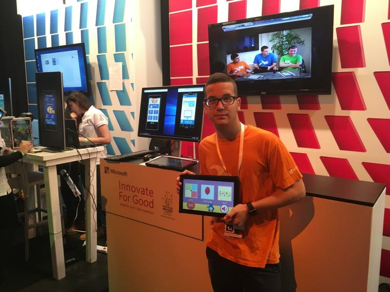

# EASYFUN C# Win APP
EASYFUN app is a native application developed in collaboration with Microsoft I4G. It won the first place in the competition held in Israel and was presented to Microsoft Israel CEO Danny Yamin and global CEO Satya Nadella at the “Think Next” event.


## Setup

1. **Clone the Repository:**
   ```
   git clone https://github.com/omertzroya/EasyFun-Win-App-C-Sharp-Project.git
   ```

## Technology Used
<div>


</div>

## Screenshots
<div style="display: flex; justify-content: space-between;">
    <div style="flex: 1; text-align: center;">
        
 
</div>

## Contributing
Feel free to contribute to the project by opening issues or creating pull requests. 

## License


